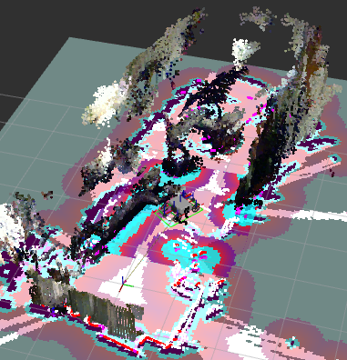

## Overview

This repository contains code made by the College of DuPage team for the NASA Lunabotics competition. It is made for ROS 2 Humble on Ubuntu 22.04. 

## Hardware

- `Intel NUC 13 Pro`
- `RPLidar S2L`
- `RPLidar A3`
- `Intel RealSense D455 Depth Camera`
- `Intel RealSense T265 Tracking Camera`
- `CTRE Falcon 500 (x2)`
- `RoyPow 12V 18Ah LiFePO4 Battery`
- `Turnigy 14.8V 12000mAh LiPo Battery`
- `AndyMark Power Distribution Panel`
- `MKS CANable Pro`

## Dependencies

- `rtabmap`
- `rtabmap_ros`
- `rplidar_ros`
- `navigation2`

## Installation

#### 1. Download the source code for [this](https://github.com/IntelRealSense/librealsense/releases/tag/v2.53.1) release and install.
`Note: this repository contains realsense-ros version 4.51.1 in external directory. This is because support was dropped for the T265 camera in later releases.`

```bash
cd Downloads/
tar -xzvf librealsense-2.53.1.tar.gz
cd librealsense-2.53.1/
mkdir build && cd build
cmake ../ -DFORCE_RSUSB_BACKEND=true -DCMAKE_BUILD_TYPE=release -DBUILD_EXAMPLES=true -DBUILD_GRAPHICAL_EXAMPLES=true
sudo make uninstall && make clean && make -j8 && sudo make install
cd ..
cd scripts
./setup_udev_rules.sh
```

#### 2. Next, clone and build the repository.

```bash
cd <ros_workspace>/src
git clone https://github.com/grayson-arendt/Lunabotics-2024.git
cd ..
colcon build
```

#### 3. Run the install_dependencies script to install the required dependencies.

```bash
cd <ros_workspace>/src/Lunabotics-2024/scripts
chmod +x install_dependencies.sh
sudo ./install_dependencies.sh
```

#### 4. Repeat the last two steps with the [external-dev](https://github.com/grayson-arendt/Lunabotics-2024/tree/external-dev?tab=readme-ov-file) branch on the host computer (not robot computer). This branch is for visualizing the robot in RViz2.

## Setup Permissions and CTRE Phoenix Library

The rplidar_ros package needs to access /dev/ttyUSB0 and /dev/ttyUSB1 (using both lidars). While you can run `sudo chmod +x 777 /dev/ttyUSB0` for example, it would need to be ran each time on startup. To fix this, run the command below and restart the computer.

```bash
sudo usermod -a -G dialout $USER
```

If the lidars are not under /dev/ttyUSB0 and /dev/ttyUSB1 (which may happen when disconnected and reconnected), use this command with one lidar connected at a time to check the number at the end. Adjust the parameter in sensor_launch.py based off the number. 

```bash
ls /dev/ttyUSB*
```

The computer may not be able to find the shared object files for CTRE Phoenix library. An easy way to fix this is to directly copy them into /usr/lib/.

```bash
cd <ros_workspace>/src/Lunabotics-2024/lunabot/autonomous/phoenix_lib/x86-64/
sudo cp libCTRE_Phoenix.so libCTRE_PhoenixCCI.so libCTRE_PhoenixTools.so /usr/lib/
```

## Running Robot

Each launch file should be ran in a new terminal window. 

`Note: unplug and replug in the T265 after booting up the NUC, it will not detect it if it is not replugged in again.`

#### 1. Navigate to ROS 2 workspace and install (repeat on each new terminal before launches):
```bash
cd <ros_workspace>
source install/setup.bash
```

#### 2. Initialize SocketCAN communication (note: the canable_start.sh script will only need to be ran once each time the robot computer boots up).
```bash
cd <ros_workspace>/src/Lunabotics-2024/scripts
chmod +x canable_start.sh 
./canable_start.sh
```

#### 3. Visualize with RViz2 (host computer):
```bash
ros2 launch bringup external_launch.py
```

#### 4. Startup sensors:

```bash
ros2 launch bringup sensor_launch.py
```
`Note: this is a separate launch file in order to check conditions of sensors before trying to start everything else.`

#### 5. Startup RTAB-Map and other nodes:

```bash
ros2 launch bringup mapping_launch.py
```

#### 6. Startup Navigation2:

```bash
ros2 launch bringup navigation_launch.py
```

In RViz2 on the host computer, you will now be able to select a "Nav2 Goal" in the GUI and have the robot navigate to that location. 

#### (Optional) 7. Startup action client:

```bash
ros2 run autonomous navigation_client
```

The action client will send two goals, one for excavation zone and another for construction zone. After the goal has been reached, it will publish to /control topic and enable the specific
motors for the mechanisms for the zone.



## Structure

- **external** (Packages from external sources)
  - realsense_ros (Version 4.51.1)
  - rf2o_laser_odometry
- **lunabot** (Contains code written specifically for Lunabotics robot)
  - **autonomous**
    - **include**
      - **ctre** (CTRE Phoenix C++ API for using Falcon 500 motors)
    - **phoenix_lib** (Contains shared object files for CTRE Phoenix C++ API)
    - **src**
      - **motor**
        - motor_controller.cpp (Controller for both autonomous and manual control of robot)
        - motor_test.cpp (Simple node for testing motors)
      - **navigation**
        - navigator_client.cpp (Action client that sends goals and motor control commands)
  - **bringup** 
    - **behavior_trees**
      - navigate_to_pose_w_replanning_and_recovery.xml (Continuously replans path and backs up for recovery)
    - **launch**
      - mapping_launch.py (Launches static transforms, lidar odometry, motor controller node, and RTAB-Map)
      - navigation_launch.py (Launches Navigation2)
      - sensor_launch.py (Launches lidars and cameras)
    - **params**
      - nav2_params.yaml (Parameters for Navigation2)
  - **description** 
    - **meshes** (Meshes for robot model in RViz2)
      - base_link.stl
      - camera_link.stl
      - ebox_link.stl
      - lidar_link.stl
      - wheel_link.stl
    - **urdf**
      - common_properties.xacro (Defines material colors)
      - test_bot.xacro (Defines links and joints for test bot)

